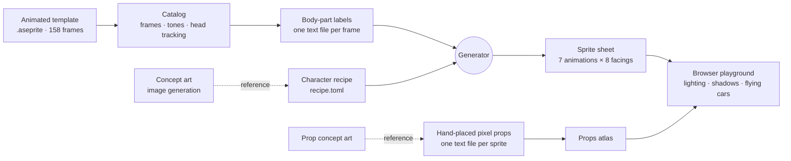
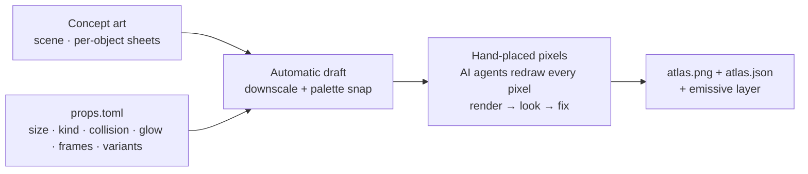
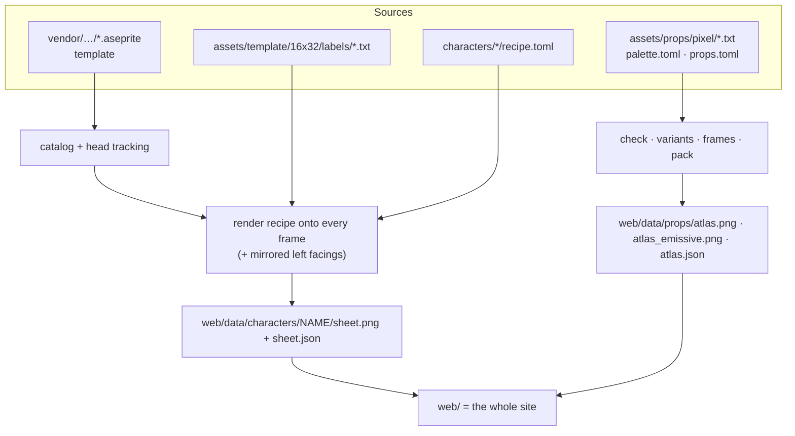
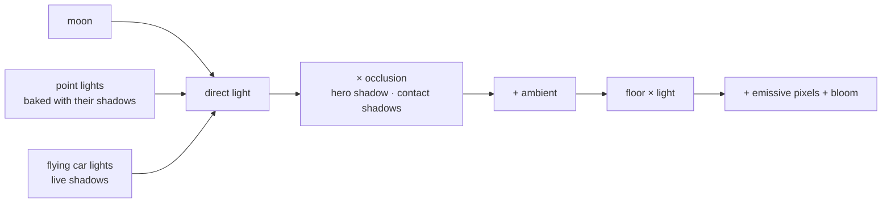

<div align="center">

# Character Generation

**From a blank, animated pixel-art mannequin to a fully animated cyberpunk character and a lit rooftop scene, with an AI agent directing (and drawing) every pixel.**

<a href="https://schlessera.github.io/character-generation/">
  
</a>

<br><br>

<a href="https://schlessera.github.io/character-generation/"></a>

<sub>Runs in the browser, no install. <kbd>WASD</kbd>/arrows move · <kbd>Shift</kbd> run · <kbd>Space</kbd> jump · <kbd>J</kbd> attack · <kbd>E</kbd> interact · <kbd>C</kbd> switch character · <kbd>V</kbd> animation gallery · <kbd>L</kbd> lighting on/off · <kbd>F</kbd> flying car</sub>

</div>

---

## What this is

An experiment in letting an AI coding agent run a whole pixel-art pipeline on its own. The starting point is a free
[character template](https://erisesra.itch.io/character-templates-pack) by Eris Esra: a bald, featureless mannequin with
158 hand-animated frames (idle, walk, run, jump, punch-and-kick, interact, turn-around) in five facing directions.

The goal was to turn those *template shapes* into the *specifics of a character design*, **Juno "Static" Okafor**, a
rooftop data courier with a magenta undercut, an LED visor and a chrome cyber-arm, across every frame of every
animation. The agent had to work out how to do that by itself, then build a small world around her and make it atmospheric.

The interesting part is not the demo but how the problem was broken down:

1. **Understand the template** and turn it into data an LLM can reason about.
2. **Label every pixel** of every template frame with the body part it belongs to.
3. **Describe a character as a recipe** (palette, per-part materials, geometric rules, small pixel grids) that
   renders onto all 158 frames at once.
4. **Draw props by hand, pixel by pixel**, using generated concept art only as a reference, because resampling
   concept art does not produce pixel art.
5. **Add light**: colored lights, per-object computed shadows, glowing neon and cars flying overhead.



---

## 1 · Understanding the template


The pack ships `.aseprite` files. A small reader (`chargen/aseprite.py`, no dependencies beyond numpy) pulls out
frames, layers and animation tags, and the catalog (`chargen/catalog.py`) normalizes them:

- **Tags → animations × directions.** The source tags contain typos (a second `Jump_Side` that is really `Jump_Up`),
  so directions come from tag *order*, which is consistent.
- **Five tones, not colors.** Every template pixel is one of exactly five colors: lit fill, shade, light shade, blush
  and ink (outline). The template's shading is the most valuable information in it, so each pixel is stored as a tone.
  Recoloring then means "map tones to a new material", which keeps the original artist's light and form.
- **Head tracking.** The head is matched against per-direction head templates in every frame, including the
  squashed and stretched heads during jumps and the spinning heads in the attack. This yields an anchor for anything
  that has to sit on the head: hair, visors, hats.
- **Left is not just a mirror.** The template only has right-facing side views. Left facings are generated by mirroring
  *and* swapping anatomical sides (see labels below), so a character with one cyber-arm keeps it on the correct arm.

## 2 · Labeling the template: what, why, how


**What.** Every opaque pixel of every unique frame (129 of the 158 frames are unique) gets a body-part label: head,
neck, torso, left/right arm, left/right hand, left/right leg, left/right foot, or effect (the white smears in the attack).
Sides are *anatomical*: facing the viewer, the character's right arm is on screen-left.

**Why.** Labels are the one-time investment that makes every character after that cheap. With labels, "a black bomber
jacket with orange cuffs and a chrome right arm" becomes a handful of rules over labels that hold in *all* frames,
including the extreme poses. Without them, every frame would need to be repainted by hand.

**How.** Automatic heuristics (head from tracking, a hip line, screen sides) produced a rough first guess. A hand-made
reference frame fixed the conventions, then eight AI subagents labeled the animations in parallel, one group each.
Each agent worked in a loop: edit the text file, validate it, render it, look at the render, fix it. They reported
back the pixels they were unsure about, for example which lit shape in a mid-air jump frame is a thigh and which is a forearm.


## 3 · A representation an LLM can actually edit

Everything the agent reads or writes about pixels is **plain text, one character per pixel**, aligned so that a row
of the image is a row of the file. A label file puts the template's tones and the labels side by side:

```text
# frame 0 rotate/all[0] 100ms head=down@9,7
   tones: . lit  s shade  # ink        labels: T torso  R/L arms  r/l hands  P/Q legs  p/q feet
25 |        #...s......s...#        |........RRRRTTTTTTTTLLLL........|
26 |        #..##ssssss##..#        |........rrrrTTTTTTTTllll........|
27 |         ## #ss##ss# ##         |.........rr.PPPPQQQQ.ll.........|
28 |            #ss##ss#            |............PPPPQQQQ............|
30 |            #ss##ss#            |............ppppqqqq............|
31 |           #..s##s..#           |...........pppppqqqqq...........|
```

Hand-drawn props use the same idea with a shared palette, where every character is a named color:

```text
# fire_barrel 13x24          O orange  y fire yellow  Y fire hot  R/r rust  # outline  . transparent
...#.#O#.....
..#O##OO#....
..#O##OyO##..
...#OOyyOOO#.
..#OyYYYYyO#.
```

This format turned out to matter a lot:

- **Readable and writable by an LLM.** Shapes are visible in the text itself. An agent can say "the left arm is
  columns 9–11 in rows 21–25" and edit exactly that.
- **Diffable and reviewable.** Every change is a text diff, and git shows exactly which pixels moved.
- **Verifiable.** Every text format has a checker (sizes, palette, "every opaque pixel is labeled") and a renderer that
  shows the result at 12× next to the character at game scale. The agents look at those renders; they don't just trust
  the text.

## 4 · From concept art to character

<table>
<tr>
<td width="62%"></td>
<td></td>
</tr>
<tr>
<td><sub>Concept turnaround (image generation): what the character <i>is</i>.</sub></td>
<td><sub>A pixel mockup at the template's proportions: what reads at 32 px.</sub></td>
</tr>
</table>

The concept art is only a reference. The character itself is a **recipe**, `characters/juno/recipe.toml`, which the
generator applies to every labeled frame:

```toml
[palette]           # color ramps; the template's tone picks the slot (base / shade / light / blush / ink)
skin   = { base = "#b07148", shade = "#7f4a2d", light = "#95593a", blush = "#b8624f" }
jacket = { base = "#34323d", shade = "#23222a", light = "#2b2a33", ink = "#141318" }
chrome = { base = "#d9e1ea", shade = "#8894a3", light = "#f4f8fb", ink = "#3a4250" }

[parts]             # body part (or group) -> material; later lines win
head = "skin"
body = "jacket"
"arm_r+hand_r" = "chrome"     # the cyber-arm, on the anatomical right in every frame

[[rules]]           # details computed from label geometry, per frame
type = "edge"       # torso pixels that touch the legs become the jacket's orange hem
part = "torso"
touching = "legs"
sides = ["down"]
color = "orange"
```

Four layers, applied in order:

1. **Materials.** Each body part gets a color ramp. The template tone picks the ramp slot, so the original shading
   carries over automatically.
2. **Rules.** Small procedural details computed from label geometry: a collar where the torso touches the neck, a hem
   where it touches the legs, a zipper stripe down the torso's center, cuffs, a glowing wrist joint, soles.
3. **Head grids.** One small pixel grid per facing, in head-local coordinates, placed on the tracked head in every
   frame: hair, the undercut and the visor. Grid characters can mean "keep the template pixel" or "use this
   material, shaded like the template pixel underneath", so one grid survives squash-and-stretch.
4. **Outline.** The silhouette gets its own ink color.

Asymmetry is handled through the anatomical sides: the undercut is on Juno's right, so the right-facing views show the
shaved side and the left-facing views show the magenta fringe.


<table>
<tr>
<td></td>
<td></td>
</tr>
</table>

### Variations are one small file

Recipes can extend each other. A colorway is only the difference:

```toml
# characters/juno-glitch/recipe.toml
extends = "juno"
name = "Juno (Glitch)"

[palette]
hair   = { base = "#9dff3a", shade = "#4fb21c", light = "#e2ff9e", ink = "#153a0a" }
jacket = { base = "#3a2a55", shade = "#271c3b", light = "#312447", ink = "#150e22" }
orange = { base = "#ff3fd2", shade = "#b8209a" }   # trim turns hot pink
```


The same idea works for props. The flying car is painted with three placeholder paint colors, and each variant in
`assets/props/props.toml` is three hex values:

```toml
flycar_parked = { w = 80, h = 38, kind = "solid", base = 14, variants = {
  red  = { "1" = "#4a0c16", "2" = "#a01c2c", "3" = "#e8484c" },
  taxi = { "1" = "#6e4a08", "2" = "#c89414", "3" = "#f6d23a" } } }
```


## 5 · Building a world: why the props are drawn by hand


Image generation is great at concept art and bad at *pixel art at a planned size*. Its "pixel art" is painted at
roughly 4–5 screen pixels per art pixel, with no consistent grid, soft glows and far more detail than 20×40 pixels can
hold. Shrinking it to game size gives mush:


Forcing the model onto a grid didn't work either. It was given a guide image with one grid cell per art pixel and a slot
per object at its exact planned size. It kept the slots, ignored the grid, and painted high resolution again:


So the pipeline splits the work:



- **The concept art decides *what* an object is:** its parts, colors and mood.
- **`props.toml` decides *how big* it is** at game scale next to the character, plus its collision footprint, glow
  color, animation timings and paint variants.
- **The pixels are placed deliberately.** Parallel agents redrew all 34 props and 24 floor and wall tiles by hand in the
  palette text format, following a written style guide (`docs/pixel-art.md`: 3/4 top-down view, light from the top left,
  2–4 shades per material, a 1 px outline, no noise). Each agent reviewed its own renders at 12× and at game scale next
  to the character, and floor tiles in a random mix to catch seams.


**Animations are frames in the same format.** A second file per frame changes only the pixels that move, so the
outline never wobbles:


## 6 · The build

One command turns all of that source material into what the browser loads:



| Command | What it does |
|---|---|
| `just build` | Packs the props atlas and renders every character sheet into `web/data/` |
| `just play` | Builds, then serves the demo at <http://localhost:8000> |
| `just preview juno` | Contact sheet of every animation × facing, plus large idle facings |
| `just heads juno` | Prints a character's head grids aligned with the template's head outlines |
| `just labels run` | Template frames colored by body part, for review |
| `just pixel vending_machine` | Reference · 12× zoom · game scale next to the character |
| `just smoke` | Headless Chromium drives the demo with the keyboard and checks the results |
| `just media` | Regenerates every image in this README from the pipeline and the running demo |

Every push to `main` runs the same build and the smoke test in GitHub Actions and deploys `web/` to GitHub Pages
(`.github/workflows/pages.yml`).

## 7 · How atmospheric can basic pixel graphics get?

With the art in place, the last step was to see how far a few technical tricks take plain pixel graphics.


- **Colored light, not darkness.** Every glowing prop becomes a light (vending machine, neon sign, fire barrel, beacon,
  mushrooms), plus the neon floor strips, the wall lights and a cool moon. Their light is added into one buffer, which
  then multiplies the scene. Colored shadows come for free: a spot in one light's shadow is still lit by the others.
- **Shadows computed from the sprites themselves.** Each opaque pixel of an object has a height above its ground line.
  Its columns are projected onto the floor away from each light and filled pixel by pixel. Shadows are soft at the
  edges and fade with distance from the object, and Juno's shadow is recomputed from her current animation frame.
- **Never darker than night.** Shadows only remove *direct* light, so any number of overlapping shadows bottoms out at
  the ambient level, never black.
- **Flat bands, no dithering.** Light fades in clean, flat-shaded steps that suit the pixel art.
- **Neon glows.** Pixels in neon and fire colors are drawn at full brightness on top of the lit scene.

<table>
<tr>
<td></td>
<td></td>
</tr>
<tr>
<td><sub>Each prop and the character cast their own shadows, away from every light.</sub></td>
<td><sub>Flying cars pass overhead. Their headlights cast live shadows as they sweep across the roof.</sub></td>
</tr>
</table>



The details are in [`docs/lighting.md`](docs/lighting.md).

---

## How the AI organized the work

This was built in a conversation with an AI coding agent (Claude). The pattern that worked, over and over:

- **Make the problem text-shaped first.** A parser, the tone/label text files and the pixel palette files came before
  any drawing.
- **Invest once, reuse everywhere.** Labeling the template took the most effort, and it made every later character and
  variant almost free.
- **Split work across parallel subagents, each with a verification loop.** Label groups, prop groups and tile sets were
  handed to separate agents. Each one validated and *looked at* its own renders before reporting, and reported the
  cases it was unsure about.
- **Use image generation for what it's good at.** Generated images were the concept art and design references. They
  were never the shipped pixels.
- **Keep everything reproducible.** Every artifact, including the images in this README, is rebuilt from source by a
  `just` command.

## Repository layout

```text
characters/          character recipes (recipe.toml) and their concept art
assets/template/     per-frame body-part labels for the 16x32 template
assets/props/        palette.toml, props.toml, hand-drawn pixel files, concept + reference art
chargen/             Python pipeline: aseprite reader, catalog, labels, recipes, props, tools
web/                 the demo (static site): engine, lighting, level; build output goes to web/data/
tools/               smoke test, benchmark, README media generator
docs/                labeling guide, pixel-art style guide, lighting notes, README images
vendor/              the Eris Esra character template (unmodified, with its license)
```

## Running it locally

Requires [uv](https://docs.astral.sh/uv/) and [just](https://just.systems/).

```sh
just setup    # Python deps + headless Chromium for the tests
just play     # build everything and serve the demo at http://localhost:8000
```

## Credits and license

**Original character template created by Eris Esra: <https://erisesra.itch.io/character-templates-pack>**

The template (v4.1) is included unmodified in [`vendor/eris-esra-character-templates/`](vendor/eris-esra-character-templates/)
so the demo builds out of the box. The template, and everything in this repository derived from it (the label files in
`assets/template/` and the character sprite sheets), remains under Eris Esra's terms, not this repository's license.
Those terms allow use in commercial and non-commercial projects and require this credit and link for free products.
They do not allow character commissions, asset packs, or reselling the template with add-ons or modifications. The
pack is pay-what-you-want. If you build on it, please get it from the link above and support the author.

Concept art and design reference images were generated with an image model (gpt-image-2). All in-game props and tiles
were drawn as pixel files in this repository.

The source code and documentation are released under the [MIT License](LICENSE).
