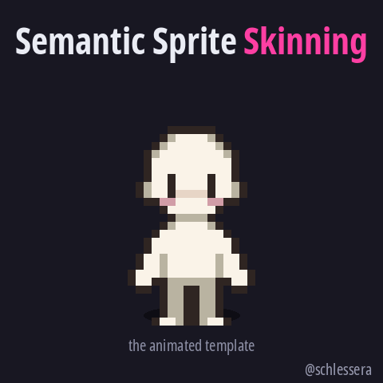
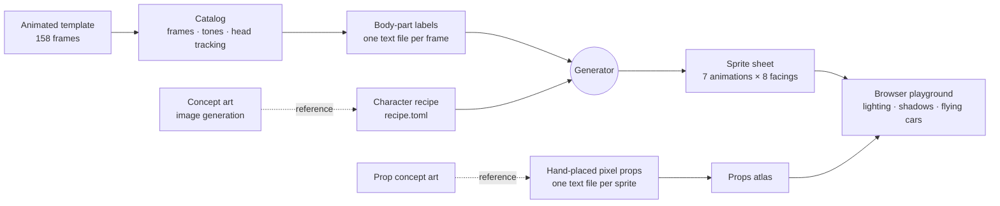
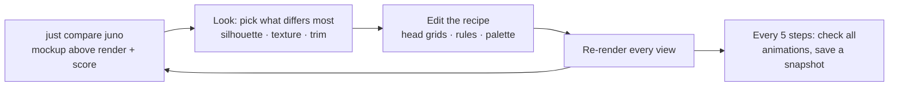
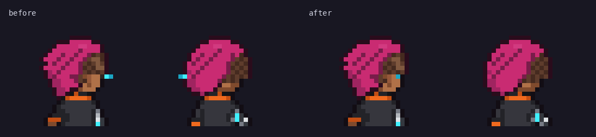
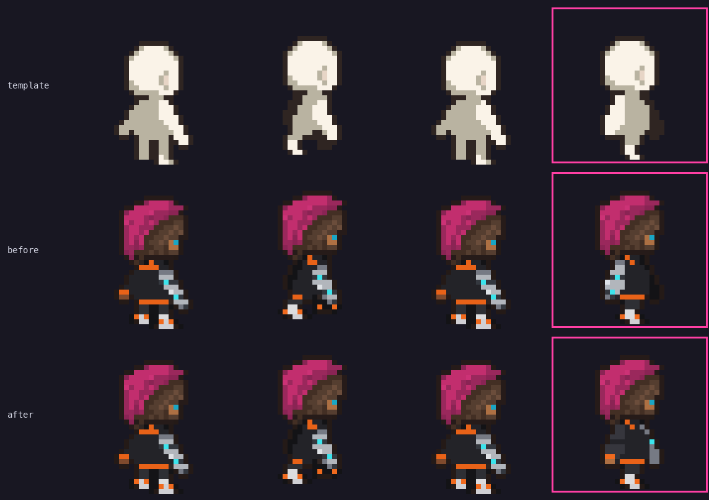
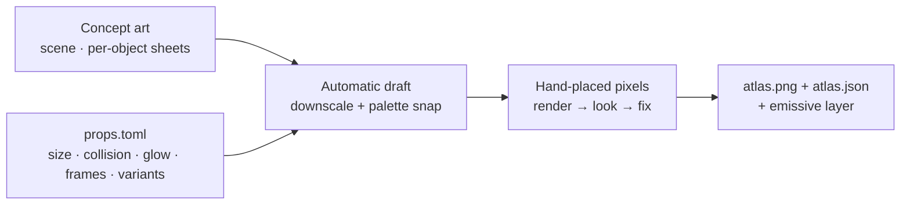
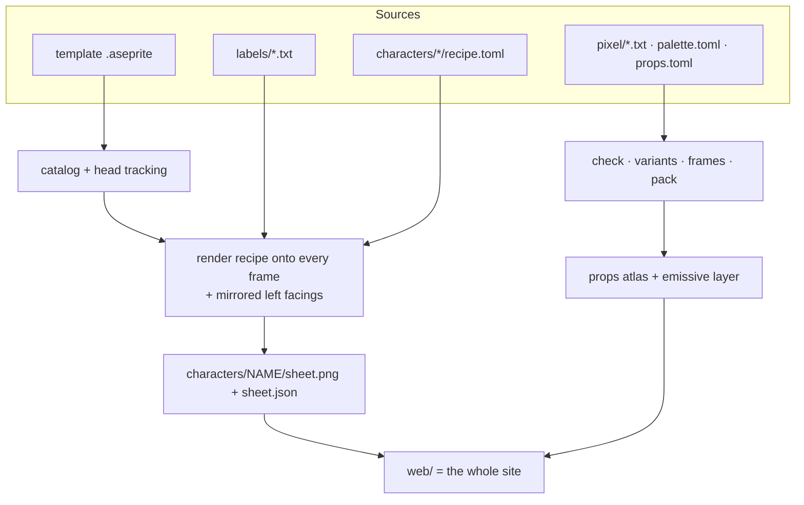
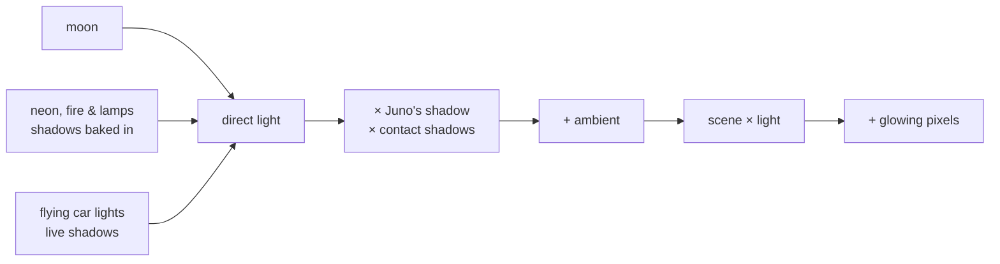

<div align="center">

# Semantic Sprite Skinning

**A faceless pixel-art mannequin becomes an animated cyberpunk courier, in a lit rooftop scene, with an AI agent
directing (and drawing) every pixel.**

<a href="https://schlessera.github.io/semantic-sprite-skinning/">
  
</a>

<br><br>

<a href="https://schlessera.github.io/semantic-sprite-skinning/"></a>

<sub>Runs in the browser, nothing to install.<br>
<kbd>WASD</kbd> / arrows move · <kbd>Shift</kbd> run · <kbd>Space</kbd> jump · <kbd>J</kbd> attack · <kbd>E</kbd> interact<br>
<kbd>C</kbd> switch character · <kbd>V</kbd> animation gallery · <kbd>L</kbd> lighting on/off · <kbd>F</kbd> call a flying car · <kbd>-</kbd>/<kbd>+</kbd> darker night</sub>

</div>

---

## The idea

Pixel-art character templates are a gift to game developers. Someone has already done the hard part, the animation,
and you "only" have to dress the mannequin. This project starts from
[Eris Esra's Character Templates Pack](https://erisesra.itch.io/character-templates-pack): a bald, featureless figure
with 158 hand-animated frames of idle, walk, run, jump, a punch-and-kick combo, interact and a turn-around, drawn in
five directions.

Dressing it is still a lot of work. Every frame has to become a specific character, the hair has to sit on a head that
squashes and stretches, and a cyber-arm has to stay on the same arm through a spinning kick. So the question behind
this repository was:

> *Can an AI agent figure out, largely by itself, how to go from generic template shapes to the specifics of a
> character design, and then build a small world around that character?*

The answer is **Juno "Static" Okafor**, a rooftop data courier with a magenta undercut, an LED visor and a chrome
cyber-arm, animated in every frame of the template and in eight directions. Around her is a rooftop full of
hand-drawn props, lit by neon, fire and passing flying cars.

We call the approach **semantic sprite skinning**. In 3D, you skin a mesh onto an animated rig. Here the rig is the
pixel template itself, and it is *semantic*: every pixel of every frame knows which body part it belongs to. A character
is then a short recipe that says what each body part is made of, and the generator skins it onto every frame the
template's artist animated.

<p align="center"></p>

The finished demo is fun, but the more interesting part is how the problem got broken down:



| | Chapter | In one sentence |
|---|---|---|
| 1 | [Meet the mannequin](#1--meet-the-mannequin) | Turning an `.aseprite` file into data an LLM can reason about |
| 2 | [Teaching the AI anatomy](#2--teaching-the-ai-anatomy) | Labeling every pixel of every frame with the body part it belongs to |
| 3 | [Pixels as text](#3--pixels-as-text) | Why every image here is also a text file |
| 4 | [Dressing the mannequin](#4--dressing-the-mannequin) | A character is a recipe that renders onto all frames at once |
| 5 | [Closing the gap](#5--closing-the-gap) | 110 rounds against the mockup: where it stopped paying off, what got it moving again, where it converged, and what the score never saw |
| 6 | [Debugging in plain text](#6--debugging-in-plain-text) | Bugs tracked down with a query and fixed with a few characters |
| 7 | [Variations for free](#7--variations-for-free) | A new colorway is a ten-line file |
| 8 | [The AI picks up the pencil](#8--the-ai-picks-up-the-pencil) | Why concept art can't just be shrunk into pixel art |
| 9 | [From sources to sprites](#9--from-sources-to-sprites) | The build that assembles everything |
| 10 | [Mood lighting](#10--mood-lighting) | How atmospheric can basic pixel graphics get? |

---

## 1 · Meet the mannequin

<p align="center"></p>

The pack ships Aseprite files, so the first step was a small reader (`chargen/aseprite.py`) that pulls out frames and
animation tags. Getting the data out was easy. Understanding it took more work, and a few details shaped everything
that followed.

The template has **no colors in the usual sense**. Every pixel is one of exactly five tones: lit fill, shade, light
shade, blush and ink. That shading is the most valuable thing in the template: it is the artist's understanding of
light and form. So the catalog stores tones, not colors. Recoloring then becomes "map each tone to a new material",
and Juno's jacket inherits the original folds and shadows for free.

The **head gets tracked** in every frame. It squashes during jumps and whips around during the attack, so each frame's
head is matched against per-direction head templates. That gives anything that has to sit on the head, like hair,
visors and hats, a reliable anchor.

And **left isn't simply a mirror image.** The template only draws the right-facing side views. Mirroring them for
the left side is fine for a symmetric mannequin, but it would move a one-sided cyber-arm to the wrong arm. How that gets
solved is the subject of the next chapter.

## 2 · Teaching the AI anatomy

<p align="center"></p>

Recoloring by tone alone gives you a mannequin in one color. To say "black bomber jacket, orange cuffs, chrome right
arm", the generator needs to know which pixels *are* the jacket, the cuffs and the right arm, in every frame and in
every pose. So every opaque pixel of all 129 unique frames carries a body-part label: head, neck, torso, left and
right arm, hand, leg and foot, plus an effects label for the white smears of the attack.

The labels are anatomical, not screen-based. When the mannequin faces you, its right arm is on your left. That rule
fixes the mirroring problem: a left-facing frame is the right-facing frame mirrored *with its left and right labels
swapped*, so the cyber-arm stays on Juno's right arm whichever way she turns.

This is by far the most expensive step, and it only has to happen once. After that, a character is a handful of rules
over labels, and those rules hold in all 158 frames, including the awkward mid-air and mid-kick poses.

The labeling itself was a small AI production line. Simple heuristics made a rough first guess: the head from
tracking, a hip line, screen sides. One carefully hand-labeled reference frame pinned down the conventions. Then
eight subagents took one group of animations each and worked in a tight loop: edit the label file, validate it,
render it, *look* at the render, fix what's wrong. Each agent came back with a list of the pixels it wasn't sure
about, for example whether a lit blob in a mid-air jump frame is a tucked thigh or a forearm.

<p align="center"></p>

## 3 · Pixels as text

Every image an agent reads or edits here is also a **plain text file with one character per pixel**, where a row of
the file is a row of the image. A label file shows the template's tones and the labels side by side:

```text
# frame 0 rotate/all[0] 100ms head=down@9,7
   tones: . lit  s shade  # ink        labels: T torso  R/L arms  r/l hands  P/Q legs  p/q feet
25 |        #...s......s...#        |........RRRRTTTTTTTTLLLL........|
26 |        #..##ssssss##..#        |........rrrrTTTTTTTTllll........|
27 |         ## #ss##ss# ##         |.........rr.PPPPQQQQ.ll.........|
28 |            #ss##ss#            |............PPPPQQQQ............|
30 |            #ss##ss#            |............ppppqqqq............|
31 |           #..s##s..#           |...........pppppqqqqq...........|
```

The hand-drawn props use the same idea, with a shared palette in which every character is a named color:

```text
# fire_barrel 13x24          O orange  y fire yellow  Y fire hot  R/r rust  # outline  . transparent
...#.#O#.....
..#O##OO#....
..#O##OyO##..
...#OOyyOOO#.
..#OyYYYYyO#.
```

That turned out to matter more than any single algorithm. An LLM can *see* the shapes in text like this, talk about
"columns 9 to 11 of rows 21 to 25", and change exactly those pixels. Every edit is a readable diff, so review is just
git. And because every format comes with a checker (sizes, palette, "every opaque pixel is labeled") and a renderer
that shows the result at 12× next to the character, the agents never had to trust their own text. They looked at the
picture.

## 4 · Dressing the mannequin

<table>
<tr>
<td width="62%"></td>
<td></td>
</tr>
<tr>
<td><sub>The concept turnaround (image generation) settles who Juno is.</sub></td>
<td><sub>A pixel mockup at the template's proportions shows what still reads at 32 pixels.</sub></td>
</tr>
</table>

The concept art is a reference, not an ingredient. Juno herself is a **recipe**, `characters/juno/recipe.toml`, that
the generator paints onto every labeled frame:

```toml
[palette]           # color ramps; the template's tone picks the slot (base / shade / light / blush / ink)
skin   = { base = "#b07148", shade = "#7f4a2d", light = "#95593a", blush = "#b8624f" }
jacket = { base = "#3b3946", shade = "#24232c", light = "#302e3a", ink = "#141318" }
chrome = { base = "#c3ccd6", shade = "#7c8796", light = "#eef3f8", ink = "#3a4250" }

[parts]             # body part (or group) -> material; later lines win
head = "skin"
body = "jacket"
"arm_r+hand_r" = "chrome"     # the cyber-arm, on the anatomical right in every frame

[[rules]]           # details computed from label geometry, per frame
type = "edge"       # torso pixels that touch the legs become the jacket's orange hem
part = "torso"
touching = "legs"
sides = ["down"]
color = "orange"
```

A recipe works in layers. First every body part gets a material, and the template's tone picks the shade, so the
original lighting carries over. Then small **rules** add details derived from the labels' geometry: a collar where the
torso meets the neck, a hem where it meets the legs, open zipper edges over a black shirt, cuffs, soles, and plate
seams with glowing joints on the cyber-arm. Because the rules are geometric, they adapt to each pose by themselves.

Hair and the visor can't be derived from the body, so they are drawn as small **head grids**, one per facing, which
get placed on the tracked head in every frame. A grid character can mean "keep the template pixel" or "use this
material, shaded like the pixel underneath", which lets a single grid survive squash-and-stretch. The anatomical
sides pay off again here: the undercut is on Juno's right, so the right-facing views show the shaved side and the
left-facing views show the magenta fringe.

<p align="center"></p>

<table>
<tr>
<td></td>
<td></td>
</tr>
</table>

## 5 · Closing the gap

The first recipe got Juno's colors and the broad strokes right, but next to the pixel mockup it was clearly an
approximation. The hair was a rounded magenta cap, not a mane sweeping to one side. The shaved side was a few brown
pixels, the jacket had a single stripe, and the cyber-arm was a plain white sleeve. The question was whether the agent
could close that gap by itself, the way a pixel artist would: look, compare, fix, look again. And for how long that
keeps paying off.

The mockup is "pixel art" from image generation, so it isn't on a clean grid either. `chargen/mockup.py` measures its
pixel size from the rhythm of its color edges (about 9 screen pixels per art pixel here), finds the grid offset where
the cells are most uniform, and snaps each of the five views back to real art pixels. Then `just compare juno` puts
every mockup view directly above the rendered sprite at the same scale, with close-ups of the heads, and prints a
similarity score.

With that side-by-side in place, the work became a loop that the agent ran on its own, 25 times:



Every five steps the recipe was saved to `characters/juno/history/step-NN.toml`, so each stage of the progression is
rebuilt from source like every other image here:

<p align="center"></p>

<p align="center"></p>

What each block of five steps did in the first run (the full log, step by step, is
[`characters/juno/history/NOTES.md`](characters/juno/history/NOTES.md)):

| steps | focus | similarity |
|---|---|---|
| 0 | first recipe: colors, rule-based trim, a simple hair cap | 0.614 |
| 1–5 | **shape.** Hair redrawn from the snapped mockup (part, sweep, buzzed side, strand lines, jagged tips), open jacket over a black shirt, high collar, cyber-arm seams and joint glows | 0.706 |
| 6–10 | **color.** Hair, jacket, chrome, orange and shoes sampled from the mockup's pixels; the visor became a framed lens; an ear on the shaved side; chest logo and back print from the concept | 0.752 |
| 11–15 | **detail and motion.** Near-black hair outline, cargo pockets and jogger cuffs, finger gaps on the cyber-hand, a circuit pattern shaved into the undercut, trim that turns with the body in the spinning attack | 0.768 |
| 16–20 | **the views the mockup doesn't show.** Strand direction on the back of the head, strand tips on the left-facing views, the collar from behind, heel tabs, a visor glint | 0.766 |
| 21–25 | **proportion.** A narrower visor at the mockup's lens widths, anchored to the front of the face and running under the hair, stubble down the temple, a straight zipper on twisted poses | 0.767 |

The similarity score is deliberately coarse. It lets every opaque pixel look for a same-colored pixel within one pixel
in the other image, so it forgives one-pixel drift but not a wrong shape or color. A perfect 1.0 is out of reach for
reasons explained below.

<p align="center"></p>

The first 25 steps show the returns diminishing. Shape (steps 1–5) and color (6–10) were the big wins. After step 15
the score was flat, and it's worth looking at why, because most of the remaining gap can't be closed by iterating the
same way. (A second run, steps 26–40, then changed the instruments rather than the recipe, and moved the score again.
That comes [after the analysis](#the-second-run-better-instruments).)

**The two images follow different rules.** Juno is built by a rule system: the template's five tones, recolored
through a small palette, plus geometric rules keyed to body-part labels. The mockup was painted by an image model that
follows none of those rules. That difference shows up in the numbers:

- **The silhouettes already match.** Counting only whether a pixel is there, allowing one pixel of drift, step 25
  matches the mockup's outline at 98 to 100% in every view. The shape was solved early (step 0 was already at 96 to
  99%). The whole remaining gap is inside the outline.
- **The palettes don't.** Each mockup view contains about 300 distinct colors, the soft, noisy shading typical of image
  generation. Juno's views use about 30, because a sprite built from ramps has a limited palette by design. Even the
  mockup itself, reduced to its own best 30 colors, only scores about 0.88 against the original. That is the practical
  ceiling for any clean-palette sprite, and step 25's 0.77 has closed a bit more than half of the distance from step 0
  to it.
- **The proportions differ.** The mockup's face is shorter: from the visor to the collar it has three rows, the template
  has five. Its visor sits a row lower, the mane ends a row or two higher, and its hem and shoes sit a row or two
  higher. The visor is anchored to the template's eyes and the trim to the template's labels, so every feature lands
  where the template's anatomy puts it, not where the mockup drew it.
- **The shading comes from the template.** Folds and light come from the template's tones, which an artist drew for a
  bald mannequin. Where the mockup shades a fold or puts a highlight somewhere else, a recipe can recolor the
  template's shading but not move it.
- **Rules have to work in every frame.** The mockup shows one idle frame per view. The recipe paints 248 frames. A
  change that would match the mockup pixel for pixel in the idle pose (a hand-placed pocket, a fold drawn exactly where
  the mockup has it) would sit in the wrong place as soon as she walks, so the agent kept to rules that hold in every
  pose, and accepted the gap.

In other words, the loop converged close to the best Juno this rule system can express. More fidelity would take a
different system (a template with the mockup's proportions, free-form body grids, hair that may overlap the shoulders),
not more iterations.

The later steps still made visible differences where the score doesn't look, but four of the most visible ones were not
found by the agent. A human watching the run pointed out that the strands on the back of the head ran
against the sweep (step 16), that the visor was too wide (step 23), and then that narrowing it had trimmed the wrong
end in the 3/4-left view, sliding the lens off the front of the face, and that the lens poked out past the back of
the head in the 3/4-back views (both step 25). Each took one step to fix once named.
The loop is good at converging on a reference. It is weaker at noticing that a detail is wrong in a way the reference
comparison doesn't measure.

Some details needed new capabilities in the generator, and the agent added them where the recipe format fell short:

- a `band` rule places a seam at a fraction of a body part's height (an elbow is always halfway down the arm, whatever
  the pose), optionally as a single pixel;
- stripes can run along a part's front or back edge, mirror their offset when the character turns around, and stay
  `straight` on twisted poses;
- `rule_facing = "head"` makes trim follow the tracked head through the spinning attack, so the zipper doesn't end up
  on her back;
- `[outline] keep` lists the head-grid colors that keep their own color on the silhouette (the ear, the hair outline);
- a `grow` rule pushes a body part's outline outward into empty pixels (the sneakers are a pixel wider than the
  template's feet on both sides), the only rule that changes the silhouette;
- a `region` rule selects the first n columns of a part from one side, the facing's front or back included (and may
  skip rows at the top), so the torso's far flank can be a shade darker in the 3/4 views, the cyber-arm's shoulder
  cap can overlap the jacket's edge, and a sleeve can hang over all but the fingertips of a hand;
- `grow` also takes the facing's front or back as a side, so the far sleeve can stand beside the torso in the 3/4
  views where the template tucks it behind;
- `compare --fit-grid VIEW` traces the mockup with a head grid cell by cell; it turned out to be a diagnostic (the
  grids were already at their optimum) rather than a tool to apply.

All of these are opt-in, so the earlier snapshots still render exactly as they did.

### The second run: better instruments

The first run ended with the score flat and the conclusion above: the remaining gap was structural. A second run of
fifteen steps (26–40) tested that conclusion by changing what the agent could *see* before changing the recipe.
`just compare` grew four instruments:

- a **loss table per body part** (head, torso, cyber-arm, feet…), in score points, per view, so the biggest leak has a
  name rather than a feeling;
- **heat-map rows** below the side-by-side, the render dimmed with its unmatched pixels in red, and the same for the
  mockup;
- `--text VIEW`: the mockup and the render as text, `mockup | render`, every pixel written as a recipe palette letter
  (`H` hair base, `H-` hair shade, `t` stubble, `r` orange, `##` outline, `??` nothing close). The mockup becomes
  something an agent can read *as a head grid*, row by row, and copy from;
- `--fit`: for every color in the render, the median mockup color underneath it. A palette suggestion table.

The first thing the fit table said was that the mockup's outline is a warm dark brown (`#241a17`), not the near-black
the recipe used. That one line was worth more than the previous ten steps (0.767 → 0.800). Then the text view showed
what the loop had been unable to see in a side-by-side image: the visor sits one row lower on the same-height head,
the whole back of the head is shaved down to the jaw in profile, the pants are the jacket's grey, the collar is open
from the front, the sneakers are white high-tops with orange caps rather than orange soles. Each head grid was
redrawn from the text view, offset by offset.

| steps | focus | similarity |
|---|---|---|
| 26–30 | **what the fit table said.** Warm outline, grey pants, a palette refit, the open collar, the visor's grey rim, white high-tops | 0.836 |
| 31–35 | **head grids read off the text view.** Profile, front and 3/4 redrawn: shaved side down to the jaw, hair from the crown, an outlined ear, a brow row over the visor; the visor on the same head row in every facing | 0.848 |
| 36–40 | **the back views and the trim.** Back grids redrawn, the hem painted over the template's ink edge, collar tips at the jacket's corners, a second palette pass | 0.867 |

What changed is that the agent could now find the rest of the way by itself, because the reference was in a form it
reads well. The human-flagged issues of the first run (strand direction, a visor too wide) were all things a text
diff makes obvious.

A third run (steps 41–55) added two more instruments and then stopped. `compare --optimize` is a bounded palette
search (each ramp slot may move up to 28 per channel, and only if the score gains); it confirmed the one color still
off, the lens cyan, and proposed one drift, a stubble shade sliding toward the hair's shadow, which is why it prints
its moves instead of applying them. `compare --ceiling` scores the mockup quantized to the recipe's own palette:
0.926, against 0.872 for the render. The cost maps put all of that remaining gap on the mockup's wider torso and far
arm, none of it on the head. With the palette and the head grids converged, the last steps went to what the metric
can't see: a collar tab that drew a "T" down the spine in the jump, the profile shoe, the Glitch colorway's outline,
and the outline and visor colors becoming ramps a colorway can swap.

| steps | focus | similarity |
|---|---|---|
| 41–45 | **the last color and the ceiling.** Lens cyan, the optimizer and the ceiling instruments, a frame review at zoom | 0.872 |
| 46–50 | **the recipe as a base for colorways.** Outline and visor rims as ramps, Glitch gets its own outline; converged | 0.872 |
| 51–55 | **consistency.** Left-facing grids in the same strand vocabulary as the redrawn right-facing ones; final animation pass and figures | 0.872 |

A fourth run (56–70) started from three complaints by the human watching, none of which the score measures: the
visor sat too low on the side views, the collar bent, the shoes were too small. The visor now has a height per
angle (the front keeps its brow row, the angled views sit at eye level, which is also what the mockup does). The
collar bent because it was an *edge* against the neck, and the neck's boundary is a U; it is now the torso's
straight top row, notched open by the zipper. The shoes needed something no rule could do: change the silhouette.
A new `grow` rule pushes a part's outline outward, and the sneakers are three pixels wide instead of two. The score
did not move. It was never looking there.

A fifth run (71–85) went after the jacket from the angles the mockup barely shows. The 3/4 views were the worst:
the zipper sat on the torso's centre column, next to the template's own shade column, so a five-pixel-wide torso
showed four colours in a row; the sleeve cuff and the hem, both orange and one row apart, merged into a stepped band;
a side-shading rule added dark columns beside every sleeve. The fix was mostly geometry: the chest front projects
toward the facing side, so the open edge moved there; the hem is painted after the zipper so it runs under the
opening; the cuff is a darker orange; the shading rule went. A `region` rule (the first n columns of a part from
its front or back) shades the far flank in the 3/4 views, and the back chevron shows its near half from 3/4 behind.
The turn-around now reads as one jacket seen from eight sides. Five more steps (86–90) removed the light
marks the concept had put on the jacket, the chest patch and the back chevron: the mockup's jacket is dark from
every angle, and the human watching preferred it that way.

The last run (91–110) was asked to reach 0.900, with license to drop the score for a good reason. The first thing
to establish was where a score could still come from: a silhouette-only comparison showed every view's outline
already matching at 0.996–1.000, so the whole gap was colour placement inside the outline, and a per-part *slack*
table (each part's loss now, minus its loss in the mockup quantized to the palette) named the torso and the
cyber-arm. Reading the text views semantically then found two real errors that no score had flagged: the neck had
been jacket-coloured since step 0, because `[parts]` listed it before `body` and later lines win; and the far
flank's shading ran after the collar and painted over it. The rest was geometry read off the mockup: the far
sleeve stands beside the torso in 3/4 (`grow` toward the facing's front), the cyber-arm's shoulder cap overlaps
the jacket's edge from 3/4 behind, the near cyber-arm stands a column further out with the jacket's shadow line
before the torso, the hem is split by the opening, the zipper runs on the front edge column in profile, only the
fingertips show past the long sleeves. One colour the optimizer had proposed twice and been refused twice went in
on a semantic reading: the stubble's shade is plum, because the shaved side sits in the magenta mane's shadow. And
a generator bug fell out of the text view: the outline that `grow` pushes out kept its pre-outline colour. The
score moved from 0.874 to 0.902, the last three thousandths from colour medians the fit table had been listing all
along.

Everything the 110 steps taught is written down as a project skill for the next character:
[`.claude/skills/mockup-character/`](.claude/skills/mockup-character/SKILL.md), with the order of work that pays, the
instruments and how to read them, the rule patterns per facing, a recipe skeleton, and the mistakes not to repeat.
An agent given a new concept and mockup should reach the same result in a fraction of the steps.

## 6 · Debugging in plain text

Because every layer of a character is text (the template's labels, the recipe, its head grids), a visual bug turns
into a question you can ask the data. Both bugs below were spotted by the human watching the demo. Finding and fixing
each one took minutes, and the fix was a few characters in the one file that was wrong.

### The visor that showed through the back of the head

**The symptom.** Seen from behind at an angle, Juno had two bright cyan pixels next to her head, as if her visor was
shining through her hair.

**Finding the source.** Instead of scrolling through 248 frames, the agent wrote a short script. It rendered every
frame of every animation, and for each frame where the tracked head faces away from the camera, it listed every pixel
that has one of the visor's cyan colors and sits on the head, the neck or the empty background:

```text
idle   up_side    0: (14, 22) (14, 23)
idle   up_side_l  0: (14, 7) (14, 8)
walk   up_side    1: (13, 22) (13, 23)
run    up_side    0: (12, 22) (12, 23)
attack down       3: (15, 25) (15, 26)     <- the spinning kick turns her head away mid-attack
...
```

The pattern said it all. It was always exactly two pixels, always in the same place relative to the head, only in the
two 3/4-back views, and in every animation. That rules out the body-part labels and the geometric rules, and points
at the one thing that is placed relative to the tracked head: the head grid for those two views. There it was:
the visor's tip, `vV`, was drawn two columns outside the head's outline.

**The fix.** Two lines in `characters/juno/recipe.toml`. A head grid is a little picture of the hair and visor for
one view, one character per pixel, placed on the tracked head in every frame. The legend maps each character to a
material, and `.` keeps the template's pixel. Here is the 3/4-back grid with its fix. From behind, only one dim pixel
of lens now shows on the cheek edge, as in the mockup:

```diff
 [head.legend]
 k = "hair.ink"      # hair outline
 b = "hair.base"     # hair
 D = "hair.deep"     # strand lines between the waves
 H = "hair.shade"
 i = "hair.light"
 u = "stubble.base"  # the shaved side: u/U checker, w for the pattern shaved into it
 U = "stubble.shade"
 w = "stubble.light"
 v = "cyan.base"     # visor lens
 V = "cyan.shade"

 [head.grids]
 up_side = """
 ...................
 .......kkkkk.......
 ....kkkbbbbbkk.....
 ...kbbbbbiibbbk....
 ..kbbbbbbDbbbbk....
 .kbbbDbbDbbDUuUk...
 kbbbDbbDbbDuwwUk...
 .kbDbbDbbDuUuwuk...
 kbbbbDbbbDUuUwwk...
 .kHbDbbbbDuUuUuk...
-.kHDbbbDDu.....vV..
+.kHDbbbDDu...V.....
 ..kHHbbbDuU........
 ..kHHbbbbk.........
 ...kHHbkk..........
 ...kHHk............
 ....kk.............
 """
```

The `vV` stuck out on and past the head's outline (the `k` that ends the rows above), where there is no face to
carry a visor. The mirrored grid for the
other 3/4-back view had the same tip on its left, where the mane covers the face, so there it simply went:

```diff
 up_side_l = """
 ...
-VvbDbbbbbbDuUuUuk.
+.kbDbbbbbbDuUuUuk.
```

<p align="center"></p>

### The arm that switched sides

**The symptom.** Walking up and to the right, for one frame out of four, the chrome cyber-arm jumped to Juno's left
side.

**Finding the source.** The arm's material comes from the body-part labels, so the question was whether a frame's
labels disagreed with its neighbors. The agent computed, for every frame, the average position of the pixels labeled
right arm and left arm, and flagged each frame where their order flips compared to the rest of its animation and
direction:

```text
rotate  all        frames 3, 4, 5     the turn-around: real
run     side       frames 64, 65      arms swinging past each other in profile: real
interact side      frame 88           the reaching arm: real
attack  side/up_side                  the spinning kick: real
walk    up_side    frame 43           seen from behind, a swinging arm can't cross the body: wrong
```

The scan narrowed 129 frames down to six groups of candidates, and a moment of judgment about the motion left
one. In frame 43
the stride pulls the near arm back toward the camera, and whoever labeled it (an agent, in chapter 2) read that arm
as the right one.

**The fix.** Swap the letters in that frame's label file, `assets/template/16x32/labels/043.txt`. Each row shows the
template's pixels on the left (`#` ink, `s` shade, `.` lit) and their body-part labels on the right (`H` head, `N`
neck, `T` torso, `R`/`L` right/left arm, `r`/`l` hands, `P`/`Q` legs, `p`/`q` feet). The tones stay; only `R` and `L`,
and `r` and `l`, trade places:

```diff
 # frame 43 walk/up_side[3] 100ms head=up_side@10,6
 16 |           #sssss...#           |...........HHHHHHHHHH...........|
 17 |            ###sss##            |............HHNNNNNH............|
-18 |            #..sss##            |............RRRTTTLL............|
-19 |            #..ssss##           |............RRRTTTTLL...........|
-20 |           #...sssss#           |...........RRRRTTTTTL...........|
-21 |           #...sssss##          |...........RRRRTTTTTLL..........|
-22 |          #....sssss##          |..........RRRRRTTTTTLL..........|
-23 |          #....sssss###         |..........RRRRRTTTTTLLL.........|
-24 |          #...ssssss###         |..........RRRRTTTTTTLLL.........|
-25 |          #..ssssss####         |..........rrrTTTTTTllll.........|
-26 |           ####sss# ##          |...........rrrPPPPP.ll..........|
+18 |            #..sss##            |............LLLTTTRR............|
+19 |            #..ssss##           |............LLLTTTTRR...........|
+20 |           #...sssss#           |...........LLLLTTTTTR...........|
+21 |           #...sssss##          |...........LLLLTTTTTRR..........|
+22 |          #....sssss##          |..........LLLLLTTTTTRR..........|
+23 |          #....sssss###         |..........LLLLLTTTTTRRR.........|
+24 |          #...ssssss###         |..........LLLLTTTTTTRRR.........|
+25 |          #..ssssss####         |..........lllTTTTTTrrrr.........|
+26 |           ####sss# ##          |...........lllPPPPP.rr..........|
 27 |              #sss#             |..............PPPPP.............|
 28 |              #..#              |..............PPPP..............|
```

On the left you can see the pose that confused the labeler: the big lit block on the left is the near arm swinging
back toward the camera, and the narrow shaded strip on the right is the far arm swinging forward.

The first version of that swap script split the rows at the wrong `|` and changed nothing. `git diff --stat` showed
zero changed lines before anything was rebuilt, which is the same safety net that makes every other edit reviewable.

<p align="center"></p>

The top row is the template itself, checked pixel for pixel against the artist's own sprite sheet: the odd-looking
fourth frame is how it was drawn, a twisting mid-step pose. It follows the rule every walk obeys, opposite arm and leg
swing together, with the arm swinging forward (away from the camera) drawn as a dark silhouette. Applying that rule to
the legs turned up one more mix-up: in the second frame the two legs were labeled the wrong way round. Juno's legs use
the same materials on both sides, so nothing changed on screen, but the labels are right now for any character whose
legs differ.

That figure caught a follow-up bug. In its first version, the "after" frame seemed to have no cyber-arm at all. The
labels were right now, but the template draws a far arm swinging behind the body entirely in outline ink, so the
chrome material had no lit or shaded pixels to work with and the arm rendered as a dark smudge. The same query
approach answered "how often does that happen?": 26 frames draw the cyber-arm entirely in ink, mostly far arms in the
run and in the spinning attack. The fix was a new rule option instead of 26 hand edits. `only_if_ink` applies a rule
only in frames where the part has no lit or shaded pixels, and two rules in the recipe use it to paint the arm's inner
pixels in chrome and add one glowing joint:

```toml
[[rules]]  # a far cyber-arm the template draws as a dark silhouette still reads as chrome
type = "all"
part = "arm_r+hand_r"
ink = true
only_if_ink = true
color = "chrome.shade"
```

### Why this works so well with an agent

- **A bug becomes a query.** Colors, labels and coordinates are data, so "where does the visor show up where it
  shouldn't?" is a ten-line script over every frame, not an hour of squinting at sprite sheets.
- **The fix lives in one place.** Nobody repainted a frame. A dozen characters of a head grid, or 55 letters of one label
  file, changed. The build then re-renders every animation, the mirrored left-facing views, the Glitch
  colorway and every image in this README.
- **Every change is reviewable.** A diff of a text file shows exactly which pixels changed and why, so the human can
  check the agent's work the same way as any other code change.
- **The loop closes visually.** After every fix the agent renders the affected frames and looks at them, and the
  figures above are rebuilt from the git history by `just media`, so the before and after stay reproducible.

## 7 · Variations for free

Once one character exists, the next one is cheap. This is the classic pixel-game palette swap (one sprite set, many
enemies), except that it works per body part: a variant can recolor only the cyber-arm, or turn the jacket trim into
another material, and still share every frame of animation with the original. Recipes can extend each other, so a new colorway only lists what
changes:

```toml
# characters/juno-glitch/recipe.toml
extends = "juno"
name = "Juno (Glitch)"

[palette]
hair   = { base = "#9dff3a", shade = "#4fb21c", light = "#e2ff9e", ink = "#153a0a" }
jacket = { base = "#3a2a55", shade = "#271c3b", light = "#312447", ink = "#150e22" }
orange = { base = "#ff3fd2", shade = "#b8209a" }   # trim turns hot pink
```

<p align="center"></p>

The same trick works for props. The flying car is painted with three placeholder paint colors, and every variant in
`assets/props/props.toml` is just three new hex values:

```toml
flycar_parked = { w = 80, h = 38, kind = "solid", base = 14, variants = {
  red  = { "1" = "#4a0c16", "2" = "#a01c2c", "3" = "#e8484c" },
  taxi = { "1" = "#6e4a08", "2" = "#c89414", "3" = "#f6d23a" } } }
```

<p align="center"></p>

## 8 · The AI picks up the pencil

<p align="center"></p>

A character needs a world, and this is where it would be tempting to let image generation do the work. It's excellent
at concept art like the rooftop above. It is not good at *pixel art at a planned size*. Its "pixel art" is painted at
roughly four or five screen pixels per art pixel, with no consistent grid, soft glows, and far more detail than a
20×40 sprite can hold. Shrinking it to game size produces mush:

<p align="center"></p>

Forcing the model onto a grid didn't help either. Given a guide image with one grid cell per art pixel and a slot per
object at its exact size, it respected the slots, ignored the grid, and painted in high resolution again:

<p align="center"></p>

So the roles got split. The concept art decides *what* an object is: its parts, colors and mood. The manifest,
`props.toml`, decides *how big* it is next to the character, along with its collision footprint, glow, animation
timing and paint variants. And the pixels themselves are placed deliberately, by agents working in the palette text
format.



A rough automatic draft (the middle column above) served only as a starting hint. Parallel agents then redrew all 34
props and 24 floor and wall tiles following a written style guide ([`docs/pixel-art.md`](docs/pixel-art.md): a 3/4
top-down view, light from the top left, two to four shades per material, a one-pixel outline). Every agent
checked its sprites at 12× and next to Juno at game scale, and checked the floor tiles in a random mix to catch seams.

<p align="center"></p>

That first set was clean but too perfect: flat fills, crisp symmetric shapes, nothing that looked used. A second pass
added texture and wear. The style guide gained a "Texture and wear" section modeled on how Juno herself is detailed:
her hair has strand lines, her shaved side is a two-shade checker, her cyber-arm has plate seams. So the props got the
same kind of deliberate texture, not noise. Metal gets seams, rivets, scratches and dents, rust runs *down* from
bolts, wood gets grain, cardboard gets tape and creases, grime gathers where things meet the roof, and nothing stays
perfectly symmetric. Five colors were added to the palette for it (grime, soot, moss, cool steel and a magenta neon
spill). Seven agents took one group each (metal, furniture, glowing props, litter, cars, floor, walls) and ran the
same render, look and fix loop. The floor needed one more round in the lit scene: the moss read as bright green specks
and a repair patch repeated too visibly across the grid, so both were toned down.

The floor then got more variety. Plain concrete now picks from eleven tiles, weighted so near-plain slabs are common
and ones with a feature (a pothole, an anchor plate, oil drips, a faded paint line) are rare. And since every tile drew
its own joints, the 16 px grid showed everywhere, so 30% of the 2×2 blocks of plain floor are now drawn as one big
32×32 slab (three designs, dealt out in turn): four quadrant tiles with joints only on the slab's outer edge. Looking
at the result also turned up an old bug: the cell hash never went above 0.5, so every tile list had only ever used
its first half.

<p align="center"></p>

Animations use the same format: each extra frame is a copy of the sprite that changes only the pixels that move, so
the outline never wobbles. That also made the texture pass easy for animated props: `pixeltool rebase` repaints every
frame from the textured first frame and carries over only each frame's own moving pixels.

<p align="center"></p>

## 9 · From sources to sprites

Everything above is source material: template, labels, recipes, pixel files and manifests. One command turns it into
what the browser loads.



| Command | What it does |
|---|---|
| `just play` | Builds everything and serves the demo at <http://localhost:8000> |
| `just build` | Packs the props atlas and renders every character sheet into `web/data/` |
| `just preview juno` | Contact sheet of every animation in every facing |
| `just heads juno` | Shows a character's head grids next to the template's head outlines |
| `just compare juno` | The pixel mockup above the rendered character, per view, with head close-ups |
| `just labels run` | Template frames colored by body part, for review |
| `just pixel vending_machine` | A sprite at 12× and at game scale next to the character |
| `just smoke` | Headless Chromium plays the demo with the keyboard and checks the results |
| `just media` | Regenerates every image in this README |

Every push to `main` runs the same build and the smoke test on GitHub Actions and publishes the demo to GitHub Pages.

## 10 · Mood lighting

With a character and a world in place, the last question was a fun one: how atmospheric can plain pixel graphics get
with a few technical tricks?

<p align="center"></p>

Quite a lot, it turns out. Every glowing prop became a colored light source: the vending machine, the neon sign, the
fire barrel, the antenna beacon, the glowing mushrooms. The neon floor strips, the wall lights and a cool moon join
them. All that light is added up in one buffer that then colors the scene, so shadows come out tinted: a spot in the
fire's shadow is still bathed in the sign's pink.

The shadows are computed from the sprites themselves. Each pixel of an object gets a height above its ground line, and
the object's columns are projected onto the floor away from every light, so a chair casts a chair-shaped shadow and a
mast casts a long, thin one. Shadows soften at the edges and fade as they stretch away from their object. Juno's shadow
is recomputed every frame from her current pose.

A few rules keep it looking like pixel art rather than a filter. Light falls off in flat bands rather than smooth
gradients. The band edges are dithered, but with a static blue-noise map anchored to the world instead of a classic
ordered pattern, so they read as fine, even grain rather than a grid of dots, and the grain stays put when the camera
moves. That matters most on a dark night (the `-`/`+` keys), where hard bands would show as rings around every
light. Neon and fire pixels are drawn at full brightness on top of the lit scene, so they
really glow. Juno glows a little too: her recipe marks the cyan ramp as emissive, so the build writes a second sheet
with just the visor lens (drawn half self-lit) and the cyber-arm's joints (fully self-lit), and a faint cyan light
pools on the roof under her cyber-arm, following it as she turns. Some props glow partly in the same way: the vending
machine's backlit window, the reflections in the neon puddles and the parked cars' standby tail lights. And shadows only ever remove direct light, so no pile-up of
overlapping shadows can get darker than the night itself.

<table>
<tr>
<td></td>
<td></td>
</tr>
<tr>
<td><sub>Every prop and the character cast their own shadows, away from every light.</sub></td>
<td><sub>Flying cars pass overhead, and their headlights sweep the roof with live shadows.</sub></td>
</tr>
</table>



The full model is described in [`docs/lighting.md`](docs/lighting.md).

---

## Behind the scenes: how the AI organized the work

All of this came out of a conversation with an AI coding agent (Claude), with image generation for the concept art.
A few patterns did most of the work:

- **First make the problem text-shaped.** The Aseprite reader, the tone and label files and the pixel palette format
  all came before any drawing.
- **Invest once, reuse everywhere.** Labeling the template was the biggest single effort, and it made every
  character and variant after that almost free.
- **Parallel agents, each with its own eyes.** Label groups, prop groups and tile sets went to separate subagents. Each
  one validated and *looked at* its own renders, and reported what it wasn't sure about.
- **Compare against the reference, not against memory.** Snapping the mockup back onto its pixel grid gave the agent
  a like-for-like picture and a score to check its render against, so it could keep improving the character without
  supervision. A human glance still caught what the comparison couldn't measure.
- **Image generation where it shines.** Generated images supplied the ideas and the references, never the shipped
  pixels.
- **Everything reproducible.** Every artifact, including the images in this README, is rebuilt from source with a
  `just` command.

## Is semantic sprite skinning a good way to make pixel characters?

Juno is "generated" in an unusual sense: nobody drew her frames, but no model painted them either. A hand-animated
template supplies the motion, a label per pixel supplies the anatomy, and a recipe of about 9 KB paints her onto all
248 frames. After building one character this way, here is an honest look at what that buys and what it costs.

**What works**

- **The animation is the template artist's.** The hardest part of a pixel character, motion that reads at 32 pixels,
  comes from a human animator and survives dressing unchanged. Squash, anticipation and the spinning kick are all
  still there.
- **Consistency comes for free.** The cyber-arm is on the right arm in every frame, the collar sits on the neck in
  every pose, and the hair follows the tracked head through a jump. Frame-by-frame generation struggles exactly here.
- **Variants are almost free.** Once the recipe exists, a colorway is a ten-line file and renders all 248 frames in
  seconds. That is the right economics for crowds of NPCs, team colors, or unlockable skins.
- **The old pixel-game tricks come back.** Pixel games have always stretched a sprite set with palette swaps: the
  same goblin in green, red and blue, a stronger enemy with a different-colored arm. Here that is not a separate
  art pass but a change of materials, and because materials are assigned per body part, the swap can be as targeted
  as "only the right arm" or "only the boots". Image-generation pipelines struggle with exactly this: every variant is
  a new generation that has to stay consistent with the others in every frame. With semantic sprite skinning the
  variant is guaranteed to share every frame of animation with the original, pixel for pixel.
- **Everything is text.** Recipes, head grids and labels are diffable and reviewable in git, and every image in this
  README is rebuilt from them. An agent can read and edit every part of the pipeline, and measure its own progress.
- **It iterates.** With a reference and a score, an agent improved the character over 25 mostly unattended rounds,
  and each improvement applied to every frame at once.

**What doesn't**

- **The template sets the ceiling.** Proportions, pose, silhouette and shading all come from the mannequin. Chunkier
  shoes, baggy trousers, a longer or shorter face, or a different light direction need a different template, not a
  better recipe. The plateau in chapter 5 is this limit showing up in numbers.
- **Anything off the body is hard.** Hair is a rigid grid glued to the head. It can't fall over the shoulders, swing
  when she runs, or lag behind a turn. Capes, long coats, held props and secondary motion would all need new
  mechanisms.
- **Rules are blunt.** A zipper is "a column through the middle of the torso". On twisted poses that can come out as a
  squiggle, and small details (a pocket, a logo) are either one pixel or not there. A pixel artist would redraw those
  frames by hand.
- **The up-front cost is high.** Every opaque pixel of 129 template frames had to be labeled before the first
  character existed. That pays off over many characters, not for one.
- **Taste still needs a human.** The agent converged on the reference but missed a visor that was too wide and hair
  strands running backwards until a person pointed them out. A score measures closeness, not whether something looks
  right.
- **Mirroring has side effects.** Left-facing frames are mirrored right-facing ones, so asymmetric designs need their
  own head grids, and the template's lighting flips with the frame.

**Iterate first, finish last.** The biggest practical win may be timing. Because a character is a recipe, the whole
cast can stay at "good enough" quality while the game itself is still changing: every animation exists, looks roughly
right and can be played and tested, and a change in design (a new jacket, a different visor, another colorway) costs
minutes instead of redrawing hundreds of frames. Once the designs stop changing, the generated sheets become the
starting point for a finishing pass, by an artist or a dedicated AI going frame by frame, that adds what rules can't
express well: secondary motion in the hair, hand-placed highlights, a cleaner zipper in the twisted poses. That pass
only has to happen once, on assets that are known to be final.

A human pixel artist doesn't get that split. Without a way to produce the 80% version of every frame at once, the
artist has to work at full fidelity from the first frame, and every design change later means redrawing all the
affected frames by hand, so designs tend to get locked early to protect the investment. Here the expensive, artistic
work moves to the end, when it is known exactly which frames will ship, and everything before that stays cheap to
change.

**Where it fits.** Compared with the alternatives, this sits in the middle. Drawing every frame by hand gives the best
result and costs the most. Generating frames with an image model is fast but inconsistent from frame to frame and not
on a real pixel grid (chapter 8 shows what happens). Rendering a 3D model down to pixels is consistent but needs the 3D
model and loses the hand-drawn feel. Recipes on a labeled template are consistent, cheap per character and fully
reproducible. They are a strong fit for many characters sharing one rig and a good first pass for an artist to finish,
but not a replacement for a pixel artist on a hero character.

## Try it yourself

You'll need [uv](https://docs.astral.sh/uv/) and [just](https://just.systems/).

```sh
just setup    # Python dependencies + headless Chromium for the tests
just play     # build everything and serve the demo at http://localhost:8000
```

<details>
<summary><b>Repository layout</b></summary>

```text
characters/          character recipes (recipe.toml) and their concept art
assets/template/     per-frame body-part labels for the 16x32 template
assets/props/        palette.toml, props.toml, hand-drawn pixel files, concept + reference art
chargen/             Python pipeline: aseprite reader, catalog, labels, recipes, props, review tools
web/                 the demo (a static site); the build writes its data to web/data/
tools/               smoke test, benchmark, README media generator
docs/                labeling guide, pixel-art style guide, lighting notes, README images
vendor/              the Eris Esra character template (unmodified, with its license)
```

</details>

---

## Credits

<div align="center">

Original character template created by **Eris Esra**<br>
<https://erisesra.itch.io/character-templates-pack>

<a href="https://erisesra.itch.io/character-templates-pack"></a>

</div>

The template (v4.1) is included unmodified in [`vendor/eris-esra-character-templates/`](vendor/eris-esra-character-templates/)
so the demo builds out of the box. It is pay-what-you-want: if this project is useful to you, please get the pack
from itch.io and support the author.

The template, and everything in this repository derived from it (the label files in `assets/template/` and the
generated character sprite sheets), stays under Eris Esra's terms rather than this repository's license. Those terms
allow use in commercial and non-commercial projects and ask free projects for exactly the credit above. They do not
allow character commissions, asset packs, or reselling the template with add-ons or modifications.

Concept art and design references were generated with an image model (gpt-image-2). Every in-game prop and tile was
drawn as a pixel file in this repository. The "Available on itch.io" badge is from the
[official itch.io press kit](https://itch.io/press-kit).

## License

The source code and documentation are released under the [MIT License](LICENSE). The template and the artwork
derived from it follow Eris Esra's terms, described above.
